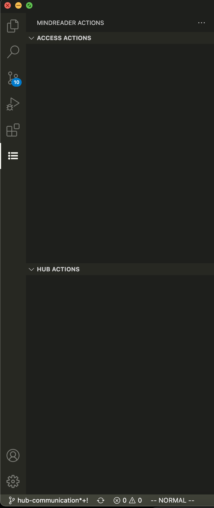
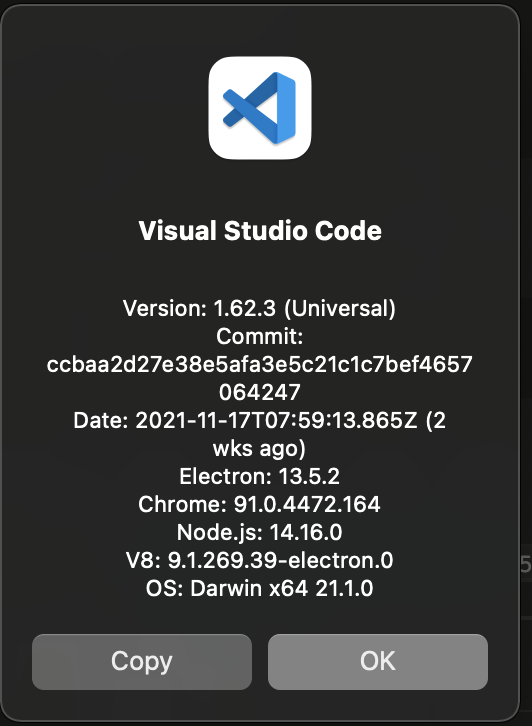

<!-- header with logo -->
<p align="center">
</img>
</p>

<h1>Mind_Reader</h1>

<!-- overview description -->

The current editor options available lack the level of accessibility that is
required to allow people who are visually impaired to adequately write, edit,
and debug code. 

This tool extends Visual Studio Code’s existing
accessibility options to enable people with a visual impairment to learn
Python programming with LEGO Mindstorms. Our goal is to:

- provide an accessible experience to people with a visual impairment

- **not** change the editing workflow for people without a visual impairment

## Major Features

- Compatibility with major screen readers:

    - [NVDA](https://www.nvaccess.org/)
    - [JAWS](https://www.freedomscientific.com/products/software/jaws/)
    - [Apple VoiceOver](https://support.apple.com/guide/voiceover-guide/welcome/web/)

<!-- TODO: still need this -->
- Play audio alerts for syntax and runtime errors.

- Present a summary of the scope for an individual line of code.

- Save and load programs directly onto the LEGO Hub from within Visual Studio Code

## Dependencies
- [Git](https://git-scm.com/)
- [Node.js](https://nodejs.org/en/)

If the compiled serial port version is incompatible, you may see no options presented in the Mind_Reader actions panel:

<p align="center">
</img>
</p>

In this case, you will also need to rebuild the serial port component with `electron-rebuild`. This is a one-time setup
for each installation of Visual Studio Code.

## Installing `electron-rebuild`
**Use Git Bash on Windows, and the terminal on MacOS/Linux. These steps will refer to this as 'the terminal'**

### 1 Install the `electron-rebuild` tool
In the terminal install electron rebuild with `npm` that is included with [Node.js](https://nodejs.org/en/):

```console
$ npm install -g electron-rebuild
```

### 2 Finding your electron version
On MacOS, go to Code > About Visual Studio Code.

On Windows and Linux, go to Help > About.

The electron version should be listed, e.g.: `Electron: 13.5.2`

<p align="center">
</img>
</p>

### 3 Finding the Mind_Reader extension directory
On MacOS and Linux this is `~/.vscode/extensions`.

On Windows this is `C:\<YOUR USER>\.vscode\extensions\`. However, in Git Bash, it will appear like on MacOS and Linux
e.g.: `~/.vscode/extensions`.

---

Find the Mind_Reader extension folder, this should look like `xxx.mind-reader-x.x.x`.

Navigate to the found folder in the terminal.

```console
$ cd ~/.vscode/extensions/<mind_reader_folder>
```

### 4 Running `electron-rebuild`

Then, run `electron-rebuild` with `ELECTRON_VERSION` replaced with the electron version found in step 2:

```console
$ electron-rebuild --version=ELECTRON_VERSION
```

# For Developers
## Development Quick Start
Use the following to set up the extension for development.

```console
$ git clone https://github.com/SingleSemesterSnobs/Mind_Reader.git
$ cd Mind_Reader
$ npm install
```

While inside the repository do

```console
$ code .
```

to open the cloned repository in VS Code.

Then, use "Run > Start Debugging" on the menu bar to start the [Extension
Development Host](https://code.visualstudio.com/api/advanced-topics/extension-host)
(<kbd>F5</kbd> by default).

---

See the Visual Studio Code [getting started](https://code.visualstudio.com/api/get-started/your-first-extension)
API page if you need more help.
