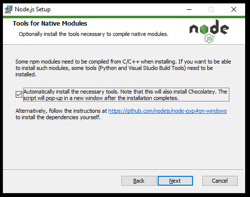

<!-- header with logo -->
<p align="center">
</img>
</p>

<h1>Mind Reader</h1>

<!-- overview description -->

The current editor options available lack the level of accessibility that is
required to allow people who are visually impaired to adequately write, edit,
and debug code. 

This tool extends Visual Studio Code’s existing
accessibility options to enable people with a visual impairment to learn
Python programming with LEGO Mindstorms. Our goal is to:

- provide an accessible experience to people with a visual impairment

- **not** change the editing workflow for people without a visual impairment

## Major Features

- Compatibility with major screen readers:

    - [NVDA](https://www.nvaccess.org/)
    - [JAWS](https://www.freedomscientific.com/products/software/jaws/)
    - [Apple VoiceOver](https://support.apple.com/guide/voiceover-guide/welcome/web/)

- Present a summary of the scope for an individual line of code.

- Save and load programs directly onto the LEGO Hub from within Visual Studio Code

## Dependencies
- [Git](https://git-scm.com/)
- [Node.js](https://nodejs.org/en/)

**NOTE**: While installing Node.js, there will be a section titled "Tools for Native Modules". Make sure that
'Automatically install the necessary tools' is checked:

<p align="center">
</img>
</p>

If the compiled serial port version is incompatible, you may see no options presented in the Mind Reader actions panel:

<p align="center">
</img>
</p>

In this case, you will also need to rebuild the serial port component with `electron-rebuild`. This is a one-time setup
for each version of Visual Studio Code. You may need to repeat this process if you update your version of Visual Studio
Code.

## Installing `electron-rebuild`
**Use Git Bash on Windows, and the terminal on MacOS/Linux. These steps will refer to this as 'the terminal'**

### 1 Install the `electron-rebuild` tool
In the terminal install electron rebuild with `npm` that is included with [Node.js](https://nodejs.org/en/):

```console
$ npm install -g electron-rebuild
```

### 2 Finding your electron version
On MacOS, go to Code > About Visual Studio Code.

On Windows and Linux, go to Help > About.

The electron version should be listed, e.g.: `Electron: 13.5.2`

<p align="center">
</img>
</p>

### 3 Finding the Mind Reader extension directory
On MacOS and Linux this is `~/.vscode/extensions`.

On Windows this is `C:\<YOUR USER>\.vscode\extensions\`. However, in Git Bash, it will appear like on MacOS and Linux
e.g.: `~/.vscode/extensions`.

---

Find the Mind Reader extension folder, this should look like `xxx.mind-reader-x.x.x`.

Navigate to the found folder in the terminal.

```console
$ cd ~/.vscode/extensions/<mind_reader_folder>
```

### 4 Running `electron-rebuild`

Then, run `electron-rebuild` with `ELECTRON_VERSION` replaced with the electron version found in step 2:

```console
$ electron-rebuild --version=ELECTRON_VERSION
```

# For Developers
## Development Quick Start
Use the following to set up the extension for development.

```console
$ git clone https://github.com/SingleSemesterSnobs/Mind Reader.git
$ cd Mind Reader
$ npm install
```

While inside the repository do

```console
$ code .
```

to open the cloned repository in VS Code.

Then, use "Run > Start Debugging" on the menu bar to start the [Extension
Development Host](https://code.visualstudio.com/api/advanced-topics/extension-host)
(<kbd>F5</kbd> by default).

---

If you get an error about a `NODE_MODULE_VERSION` incompatibility or that a file is not a Windows executable,
this is likely the error described above. Run `npm i -g electron-rebuild` if you have not done so and follow the
directions above.

---

See the Visual Studio Code [getting started](https://code.visualstudio.com/api/get-started/your-first-extension)
API page if you need more help.

# Setting Up Line Highlighter
Before running Mind Reader for the first time it is recommended to add the following code block to your settings.json

### Opening Settings.json
1. Launch VS Code
2. Open the `Command Palette` by pressing **Ctrl + Shift + P** (Windows) / **Cmd + Shift + P** (Mac)
3. The Command Palette should appear at the top of your screen ready for you to type
4. Type `settings` and highlight the option that appears saying `Preferences: Open Settings (JSON)` then select it
5. Your `settings.json` window should appear, scroll to the bottom and make sure the last item has a `,`  before the closing curly bracket `}`
6. Paste the following code block after the comma `,`, but before the closing curly bracket `}`:
```
    "mind-reader.lineHighlighter.isEnabled"          : true,
    "mind-reader.lineHighlighter.multiLineIsEnabled" : false,
        
    "mind-reader.lineHighlighter.backgroundColor"    : "#232C5C",
        
    "mind-reader.lineHighlighter.outlineColor"       : "#4866FE",
    "mind-reader.lineHighlighter.outlineWidth"       : "1px",
    "mind-reader.lineHighlighter.outlineStyle"       : "solid",
        
    "mind-reader.lineHighlighter.borderColorTop"     : "#FFFFFF",
    "mind-reader.lineHighlighter.borderColorRight"   : "#FFFFFF",
    "mind-reader.lineHighlighter.borderColorBottom"  : "#FFFFFF",
    "mind-reader.lineHighlighter.borderColorLeft"    : "#FFFFFF",
        
    "mind-reader.lineHighlighter.borderWidthTop"     : "1px",
    "mind-reader.lineHighlighter.borderWidthRight"   : "16px",
    "mind-reader.lineHighlighter.borderWidthBottom"  : "1px",
    "mind-reader.lineHighlighter.borderWidthLeft"    : "1px", 
        
    "mind-reader.lineHighlighter.borderStyleTop"     : "solid",
    "mind-reader.lineHighlighter.borderStyleRight"   : "solid",
    "mind-reader.lineHighlighter.borderStyleBottom"  : "solid",
    "mind-reader.lineHighlighter.borderStyleLeft"    : "solid",
        
    "mind-reader.lineHighlighter.fontStyle"          : "normal",
    "mind-reader.lineHighlighter.fontWeight"         : "bolder",
    "mind-reader.lineHighlighter.textDecoration"     : "none",
    "mind-reader.lineHighlighter.textColor"          : "#FFFFFF",
```
The values are set to the default values and can be changed here manually, or through the settings window (File -> Preferences -> Settings -> Mind Reader -> Line Highlighter).
Changes made directly in the settings.json will take effect automatically; however, if you change them in the settings window then after you input your new values VS Code must be closed and reopened for the changes to take effect.

After adding the code block, the `settings.json` file should look similar to this:

<p align="center">
</img>
</p>

7. Save and close `settings.json`

### Line Highlighter Settings Table
| **Item**               | **Description**                                              | **Expected Value**                                                           | **Default Values** |
|------------------------|-------------------------------------------------------|------------------------------------------------------------------------------|--------------------|
| **isEnabled**          | Enable/Disables the line highlighter                  | boolean                                                                      | true               |
| **multiLineIsEnabled** | Highlight when clicking and dragging to select        | boolean                                                                      | false              |
| **backgroundColor**    | Changes the background color of the highlight         | HEX(A), RGB(A), HSL(A), String,  or none                                     | "#232C5C"          |
| **outlineColor**       | Outline Color                                         | HEX(A), RGB(A), HSL(A), String,  or none                                     | "#4866FE"          |
| **outlineWidth**       | Outline Width                                         | "medium", "thin", "thick", length, or none                                   | "1px"              |
| **outlineStyle**       | Outline Style                                         | none, hidden, dotted, dashed, solid, double, groove, ridge, inset, or outset | "solid"            |
| **borderColorTop**     | Top Border Color                                      | HEX(A), RGB(A), HSL(A), String,  or none                                     | "#FFFFFF"          |
| **borderColorRight**   | Right Border Color                                    | HEX(A), RGB(A), HSL(A), String,  or none                                     | "#FFFFFF"          |
| **borderColorBottom**  | Bottom Border Color                                   | HEX(A), RGB(A), HSL(A), String,  or none                                     | "#FFFFFF"          |
| **borderColorLeft**    | Left Border Color                                     | HEX(A), RGB(A), HSL(A), String,  or none                                     | "#FFFFFF"          |
| **borderWidthTop**     | Top Border Width                                      | "medium", "thin", "thick", length, or none                                   | "1px"              |
| **borderWidthRight**   | Right Border Width                                    | "medium", "thin", "thick", length, or none                                   | "16px"             |
| **borderWidthBottom**  | Bottom Border Width                                   | "medium", "thin", "thick", length, or none                                   | "1px"              |
| **borderWidthLeft**    | Left Border Width                                     | "medium", "thin", "thick", length, or none                                   | "1px"              |
| **borderStyleTop**     | Top Border Style                                      | none, hidden, dotted, dashed, solid, double, groove, ridge, inset, or outset | "solid"            |
| **borderStyleRight**   | Right Border Style                                    | none, hidden, dotted, dashed, solid, double, groove, ridge, inset, or outset | "solid"            |
| **borderStyleBottom**  | Bottom Border Style                                   | none, hidden, dotted, dashed, solid, double, groove, ridge, inset, or outset | "solid"            |
| **borderStyleLeft**    | Left Border Style                                     | none, hidden, dotted, dashed, solid, double, groove, ridge, inset, or outset | "solid"            |
| **fontStyle**          | Styling to the font contained within the highlight    | normal, italic, oblique, or none                                             | "normal"           |
| **fontWeight**         | Weight of the font contained within the highlight     | "normal", "bold", "bolder", "lighter", string based number, "none"           | "bolder"           |
| **textDecoration**     | Decoration of the font contained within the highlight | See: https://www.w3schools.com/cssref/pr_text_text-decoration.asp            | "none"             |
| **textColor**          | Color of the font contained within the highlight      | HEX(A), RGB(A), HSL(A), String,  or none                                     | "#FFFFFF"          |


# Contact Information

### Single Semester Snobs
#### Fall 2021 Semester
- Jake Grossman: [\<JacobGrossman2@my.unt.edu\>](mailto:JacobGrossman2@my.unt.edu)
- Cal Wooten: [\<calwooten@my.unt.edu\>](mailto:calwooten@my.unt.edu)
- Josiah Moses: [\<josiahmoses@my.unt.edu\>](mailto:josiahmoses@my.unt.edu)
- Sophia Drewfs: [\<sophiadrewfs@my.unt.edu\>](mailto:sophiadrewfs@my.unt.edu)
- Mason Bone: [\<masonbone@my.unt.edu\>](mailto:masonbone@my.unt.edu)

### We Don't Byte
#### Spring 2022 Semester
- John Breaux: [\<JohnBreaux@my.unt.edu\>](mailto:JohnBreaux@my.unt.edu)
- Thomas Lane: [\<ThomasLane2@my.unt.edu\>](mailto:ThomasLane2@my.unt.edu)
- Kendrick Johnson: [\<KendrickJohnson@my.unt.edu\>](mailto:KendrickJohnson@my.unt.edu)
- Ryan Tolbert: [\<RyanTolbert@my.unt.edu\>](mailto:RyanTolbert@my.unt.edu)
- Pedro Alvarez: [\<PedroAlvarez3@my.unt.edu\>](mailto:PedroAlvarez3@my.unt.edu) 
