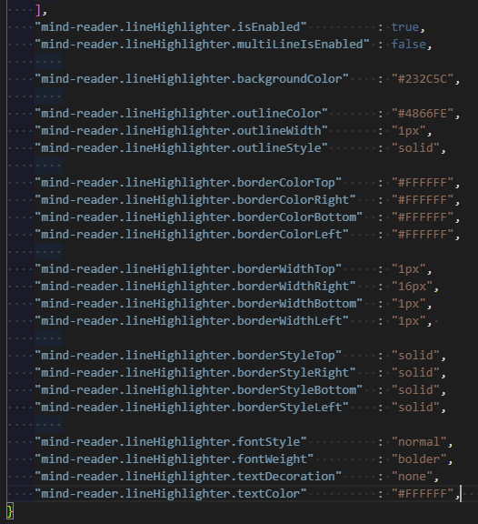

<!-- header with logo -->
<p align="center">
</img>
</p>

<h1>Mind Reader</h1>

<!-- overview description -->

The current editor options available lack the level of accessibility that is
required to allow people who are visually impaired to adequately write, edit,
and debug code.

This tool extends Visual Studio Code’s existing
accessibility options to enable people with a visual impairment to learn
Python programming with LEGO Mindstorms. Our goal is to:

- provide an accessible experience to people with a visual impairment

- **not** change the editing workflow for people without a visual impairment

## Major Features

- Compatible with major screen readers:

    - [NVDA](https://www.nvaccess.org/)
    - [JAWS](https://www.freedomscientific.com/products/software/jaws/)
    - [Apple VoiceOver](https://support.apple.com/guide/voiceover-guide/welcome/web/)

- Present a summary of the scope for an individual line of code.

- Save, Load, Run, and Delete programs directly onto the LEGO SPIKE Prime Hub from within Visual Studio Code

- Line highlighting with customizable colors and formats

- Voice hotkeys through the use of an exterior python server.

- Voice functions through the use of an exterior python server.

- Relevant autocomplete voiceovers on demand.
# Configure Line Highlighter
The Line Highlighter feature is customizable. Changes to the highlighter's appearance can be done through your `settings.json` or through the settings window.
Before running Mind Reader for the first time it is recommended to add the following code block to your `settings.json` file

### Configure through settings.json
1. Launch VS Code
2. Open the `Command Palette` by pressing **Ctrl + Shift + P** (Windows) / **Cmd + Shift + P** (Mac)
3. The Command Palette should appear at the top of your screen ready for you to type
4. Type `settings` and highlight the option that appears saying `Preferences: Open Settings (JSON)` then select it
5. Your `settings.json` window should appear, scroll to the bottom and make sure the last item has a `,`  before the closing curly bracket `}`
6. Paste the following code block (or the portion you want to change) after the last comma `,`, but before the closing curly bracket `}`:
```
    "mind-reader.lineHighlighter.isEnabled"          : true,
    "mind-reader.lineHighlighter.multiLineIsEnabled" : false,

    "mind-reader.lineHighlighter.backgroundColor"    : "#232C5C",

    "mind-reader.lineHighlighter.outlineColor"       : "#4866FE",
    "mind-reader.lineHighlighter.outlineWidth"       : "1px",
    "mind-reader.lineHighlighter.outlineStyle"       : "solid",

    "mind-reader.lineHighlighter.borderColorTop"     : "#FFFFFF",
    "mind-reader.lineHighlighter.borderColorRight"   : "#FFFFFF",
    "mind-reader.lineHighlighter.borderColorBottom"  : "#FFFFFF",
    "mind-reader.lineHighlighter.borderColorLeft"    : "#FFFFFF",

    "mind-reader.lineHighlighter.borderWidthTop"     : "1px",
    "mind-reader.lineHighlighter.borderWidthRight"   : "16px",
    "mind-reader.lineHighlighter.borderWidthBottom"  : "1px",
    "mind-reader.lineHighlighter.borderWidthLeft"    : "1px",

    "mind-reader.lineHighlighter.borderStyleTop"     : "solid",
    "mind-reader.lineHighlighter.borderStyleRight"   : "solid",
    "mind-reader.lineHighlighter.borderStyleBottom"  : "solid",
    "mind-reader.lineHighlighter.borderStyleLeft"    : "solid",

    "mind-reader.lineHighlighter.fontStyle"          : "normal",
    "mind-reader.lineHighlighter.fontWeight"         : "bolder",
    "mind-reader.lineHighlighter.textDecoration"     : "none",
    "mind-reader.lineHighlighter.textColor"          : "#FFFFFF",
```
After adding the code block, the `settings.json` file should look similar to this:

<p align="center">
</img>
</p>

7. Save and close `settings.json`
    - The values are set to the default values and can be changed here manually. Changes made directly in the settings.json will take effect automatically.

### Configure through Settings Window
1. Open the settings window 
    - Windows: Ctrl + , or File -> Preferences -> Settings
    - Mac: Command + , or Code -> Settings -> Settings
2. Navigate to Extensions -> Mind Reader -> Line Highlighter
3. Make any changes you need
4. Close the settings window
    - You may need to restart VS Code to apply the changes

### Line Highlighter Settings Table
| **Item**               | **Description**                                              | **Accepted Value**                                                           | **Default Values** |
|------------------------|-------------------------------------------------------|------------------------------------------------------------------------------|--------------------|
| **isEnabled**          | Enable/Disables the line highlighter                  | boolean                                                                      | true               |
| **multiLineIsEnabled** | Highlight when clicking and dragging to select lines  | boolean                                                                      | false              |
| **backgroundColor**    | Changes the background color of the highlight         | HEX(A), RGB(A), HSL(A), Predefined Color String, or "none"                   | "#232C5C"          |
| **outlineColor**       | Outline Color                                         | HEX(A), RGB(A), HSL(A), Predefined Color String, or "none"                   | "#4866FE"          |
| **outlineWidth**       | Outline Width                                         | "medium", "thin", "thick", length (integer + string unit), or "none"         | "1px"              |
| **outlineStyle**       | Outline Style                                         | none, hidden, dotted, dashed, solid, double, groove, ridge, inset, or outset | "solid"            |
| **borderColorTop**     | Top Border Color                                      | HEX(A), RGB(A), HSL(A), Predefined Color String, or "none"                   | "#FFFFFF"          |
| **borderColorRight**   | Right Border Color                                    | HEX(A), RGB(A), HSL(A), Predefined Color String, or "none"                   | "#FFFFFF"          |
| **borderColorBottom**  | Bottom Border Color                                   | HEX(A), RGB(A), HSL(A), Predefined Color String, or "none"                   | "#FFFFFF"          |
| **borderColorLeft**    | Left Border Color                                     | HEX(A), RGB(A), HSL(A), Predefined Color String, or "none"                   | "#FFFFFF"          |
| **borderWidthTop**     | Top Border Width                                      | "medium", "thin", "thick", length (integer + string unit), or "none"         | "1px"              |
| **borderWidthRight**   | Right Border Width                                    | "medium", "thin", "thick", length (integer + string unit), or "none"         | "16px"             |
| **borderWidthBottom**  | Bottom Border Width                                   | "medium", "thin", "thick", length (integer + string unit), or "none"         | "1px"              |
| **borderWidthLeft**    | Left Border Width                                     | "medium", "thin", "thick", length (integer + string unit), or "none"         | "1px"              |
| **borderStyleTop**     | Top Border Style                                      | none, hidden, dotted, dashed, solid, double, groove, ridge, inset, or outset | "solid"            |
| **borderStyleRight**   | Right Border Style                                    | none, hidden, dotted, dashed, solid, double, groove, ridge, inset, or outset | "solid"            |
| **borderStyleBottom**  | Bottom Border Style                                   | none, hidden, dotted, dashed, solid, double, groove, ridge, inset, or outset | "solid"            |
| **borderStyleLeft**    | Left Border Style                                     | none, hidden, dotted, dashed, solid, double, groove, ridge, inset, or outset | "solid"            |
| **fontStyle**          | Styling to the font contained within the highlight    | "normal", "italic", "oblique", or "none"                                     | "normal"           |
| **fontWeight**         | Weight of the font contained within the highlight     | "normal", "bold", "bolder", "lighter", string based number, "none"           | "bolder"           |
| **textDecoration**     | Decoration of the font contained within the highlight | See: https://www.w3schools.com/cssref/pr_text_text-decoration.asp            | "none"             |
| **textColor**          | Color of the font contained within the highlight      | HEX(A), RGB(A), HSL(A), Predefined Color String, or "none"                   | "#FFFFFF"          |

# Speech Recognition
If you are running Mind Reader on MacOS, you may need to install a package called portaudio. This package allows microphone input for PyAudio, a package for audio I/O. You will need to 
install homebrew to get portaudio installed. Here are the steps:
1. Close Visual Studio Code
2. Go to [Homebrew](https://brew.sh/) and follow the steps to install Homebrew
3. On a terminal, run `brew install portaudio`

The Speech Recognition feature should be able to run now. If you are still getting errors, you may need to reinstall the extension.

# For Developers
## Developer Dependencies
### Development environment setup guide
### Windows 10 or 11
1. Clone this repo
2. Open a terminal to the root directory
    - You can achieve that by doing one of the following:
        - Press **Control-Shift-`** in VS Code
        - Select on the menu bar, Terminal > New Terminal in VS Code
        - Typing "cmd" in the address bar of the directory in File Explorer
3. Run `npm i`

### macOS
1. Clone this repo
2. Open a terminal to the root directory
    - You can achieve that by doing one of the following:
        - Press **Control-Shift-`**
        - Select on the menu bar, Terminal > New Terminal
3. Run `npm i`

### To run the extension
1. Have a terminal open and make sure that it is in the root directory
2. Run `npm run compile`. This will compile the TypeScript files.
3. Run `npm run watch`. This will reload the extension if you make any changes to the files.
4. Run the extension by pressing the F5 key 
    - You can also select the "Run and Debug" tab, then select "Run Extension" and press the green play button

### Alternative
Instead of cloning this repo, you could also
- Download the [install-windows.ps1](setup-development/windows/install-windows.ps1) file (Windows) and run `./install-windows.ps1` in PowerShell as a normal user, and accept any UAC prompts that pop up.
    - The installation should take around 8 minutes. If an installer doesn't pop up, don't be alarmed.
- Download the [install-linux.sh](setup-development/windows/install-linux.sh) file (Mac) and run `./install-linux.sh` in the terminal.

For other platforms, or to install the extension manually, check out our [Developer Install Guide](../../wiki/Developer-Install-Guide). This is also where you should search if you encounter errors.

See the Visual Studio Code [getting started](https://code.visualstudio.com/api/get-started/your-first-extension)
API page if you need more help.


# Contact Information

### Single Semester Snobs
#### Fall 2021 Semester
- Jake Grossman: [\<JacobGrossman2@my.unt.edu\>](mailto:JacobGrossman2@my.unt.edu)
- Cal Wooten: [\<calwooten@my.unt.edu\>](mailto:calwooten@my.unt.edu)
- Josiah Moses: [\<josiahmoses@my.unt.edu\>](mailto:josiahmoses@my.unt.edu)
- Sophia Drewfs: [\<sophiadrewfs@my.unt.edu\>](mailto:sophiadrewfs@my.unt.edu)
- Mason Bone: [\<masonbone@my.unt.edu\>](mailto:masonbone@my.unt.edu)

### We Don't Byte
#### Spring 2022 Semester
- John Breaux: [\<JohnBreaux@my.unt.edu\>](mailto:JohnBreaux@my.unt.edu)
- Thomas Lane: [\<ThomasLane2@my.unt.edu\>](mailto:ThomasLane2@my.unt.edu)
- Kendrick Johnson: [\<KendrickJohnson@my.unt.edu\>](mailto:KendrickJohnson@my.unt.edu)
- Ryan Tolbert: [\<RyanTolbert@my.unt.edu\>](mailto:RyanTolbert@my.unt.edu)
- Pedro Alvarez: [\<PedroAlvarez3@my.unt.edu\>](mailto:PedroAlvarez3@my.unt.edu)

### Five Guys
#### Fall 2022 Semester
- Zachary Chenausky: [\<zacharychenausky@my.unt.edu\>](mailto:zacharychenausky@my.unt.edu)
- Jigme Rinji Sherpa: [\<jigmesherpa@my.unt.edu\>](mailto:jigmesherpa@my.unt.edu)
- Clay Lewis: [\<claylewis2@my.unt.edu\>](mailto:ClayLewis2@my.unt.edu)
- Haris Javed: [\<harisjaved@my.unt.edu\>](mailto:harisjaved@my.unt.edu)
- Saad Javed: [\<saadjaved@my.unt.edu\>](mailto:saadjaved@my.unt.edu)

### Spam Artists
#### Fall 2023 Semester
- Kevin Gautier: [\<kevingautier@my.unt.edu\>](mailto:kevingautier@my.unt.edu)
- Alex Tomjack: [\<Alextomjack@my.unt.edu\>](mailto:alextomjack@my.unt.edu)
- Kelsee Villareal: [\<KelseeVillareal@my.unt.edu\>](mailto:kelseevillareal@my.unt.edu)
- Bryan Tang: [\<BryanTang@my.unt.edu\>](mailto:bryantang@my.unt.edu)
